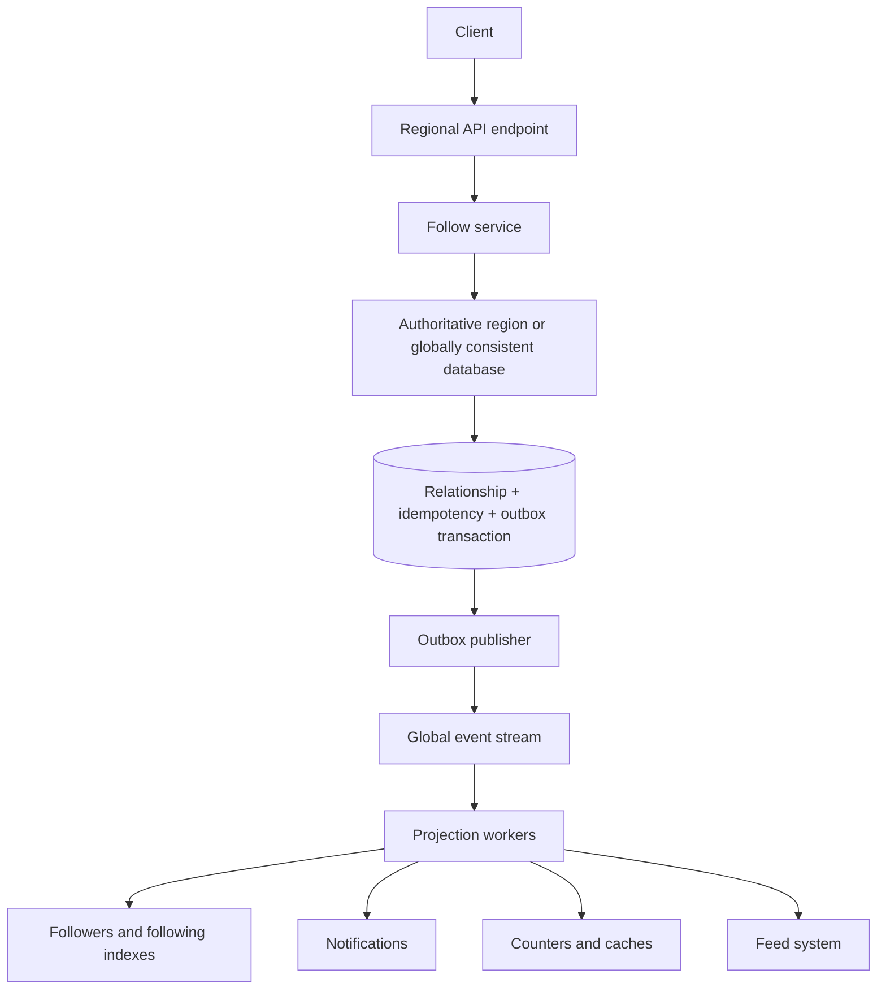

# Distributed Follow Service Design

## 1. Scope

This document designs a Twitter/Instagram-style follow service. It supports:

- Follow and unfollow.
- Public and private accounts.
- Pending follow requests for private accounts.
- Lists of followers and followed accounts.
- Follower and following counts.
- Relationship status checks.
- Blocks.
- Notifications and downstream feed updates.
- Idempotent writes and safe request retries.
- Deployment across multiple geographic regions.

The direction of an edge is:

```text
(follower_id, followee_id)
```

For example, if Alice follows Bob:

```text
(Alice, Bob)
```

The relationship record is authoritative. Counts, notifications, feeds, caches, and large follower-list indexes are derived asynchronously.

## 2. High-level architecture



The client receives success after the authoritative database transaction commits. It does not wait for notifications, counters, or feed processing.

## 3. API design

Resource-oriented endpoints express the desired final state:

```http
PUT /v1/me/following/{followeeId}
Idempotency-Key: 96b6f80c-...
If-Match: "relationship-version-7"
```

```http
DELETE /v1/me/following/{followeeId}
Idempotency-Key: a1246b3e-...
If-Match: "relationship-version-8"
```

The authenticated identity determines `follower_id`. The service must not trust a follower ID supplied in the request body.

Useful read APIs include:

```http
GET /v1/users/{userId}/followers?limit=50&cursor=...
GET /v1/users/{userId}/following?limit=50&cursor=...
GET /v1/me/relationships/{userId}
```

Example response:

```json
{
  "followerId": "user-123",
  "followeeId": "user-456",
  "state": "FOLLOWING",
  "version": 8
}
```

For a private account, the `PUT` operation produces `PENDING` rather than `FOLLOWING`. The relationship becomes `FOLLOWING` only after the followee accepts the request.

## 4. Authoritative relationship schema

```sql
CREATE TABLE user_relationships (
    follower_id        BIGINT NOT NULL,
    followee_id        BIGINT NOT NULL,
    state              VARCHAR(20) NOT NULL,
    version            BIGINT NOT NULL,
    followed_at        TIMESTAMP,
    updated_at         TIMESTAMP NOT NULL,
    last_operation_id  UUID NOT NULL,

    PRIMARY KEY (follower_id, followee_id),

    CHECK (follower_id <> followee_id),
    CHECK (state IN ('FOLLOWING', 'PENDING', 'REMOVED'))
);
```

Indexes for the two traversal directions:

```sql
CREATE INDEX relationships_by_follower
ON user_relationships (
    follower_id,
    state,
    followed_at DESC,
    followee_id
);

CREATE INDEX relationships_by_followee
ON user_relationships (
    followee_id,
    state,
    followed_at DESC,
    follower_id
);
```

The primary key prevents two physical rows for the same edge.

`REMOVED` is a temporary tombstone rather than an immediate hard delete. It preserves the relationship version long enough to reject stale requests. Tombstones can be deleted after the system's supported retry window.

Blocks should normally use a separate directional table:

```sql
CREATE TABLE user_blocks (
    blocker_id  BIGINT NOT NULL,
    blocked_id  BIGINT NOT NULL,
    created_at  TIMESTAMP NOT NULL,
    PRIMARY KEY (blocker_id, blocked_id)
);
```

A block overrides existing and future follow relationships between the two accounts according to the product's policy.

## 5. Why a unique relationship key is insufficient

A constraint such as:

```sql
PRIMARY KEY (follower_id, followee_id)
```

guarantees only that the database cannot store duplicate relationship rows. It does not make the complete business operation idempotent.

### 5.1 Duplicate side effects

A follow operation can involve:

1. Inserting the relationship.
2. Incrementing the followee's follower count.
3. Incrementing the follower's following count.
4. Sending a notification.
5. Updating the feed system.

If the client times out and retries, the unique constraint prevents a second relationship row. Incorrect application logic could still increment counters twice, send two notifications, or publish two events.

The service must distinguish a real state transition from a no-op:

```text
NOT_FOLLOWING -> FOLLOWING  : emit FOLLOW_CREATED
FOLLOWING     -> FOLLOWING  : no-op; emit nothing
FOLLOWING     -> REMOVED    : emit FOLLOW_REMOVED
REMOVED       -> REMOVED    : no-op; emit nothing
```

### 5.2 The unique key does not remember the request result

Consider:

```text
1. The database inserts the relationship and commits.
2. The service crashes before returning the response.
3. The client retries.
```

The unique constraint indicates that the row exists, but it does not say:

- Whether this request originally created it.
- What response was returned or should be returned.
- Whether downstream events were already created.
- Whether an idempotency key is being reused for a different request.

### 5.3 The unique key does not reject stale intent

The most subtle failure is a delayed request:

```text
T1: Alice sends Follow Bob, but the request is delayed.
T2: Alice sends Unfollow Bob, and it succeeds.
T3: The delayed Follow request arrives.
```

At T3 there may be no active row, so the unique constraint allows the old follow request to recreate the relationship. The older request has overwritten Alice's newer intent.

Relationship versioning or conditional writes are needed to reject the stale request.

### 5.4 The unique key does not provide multi-record atomicity

The relationship, idempotency record, and outbox event must either all commit or all roll back. A uniqueness constraint cannot provide that guarantee by itself; a transaction is required.

## 6. Layers of idempotency

The design uses several complementary mechanisms:

1. **Resource-oriented methods:** `PUT` means make the relationship present, and `DELETE` means make it absent.
2. **Unique relationship key:** prevents duplicate physical edge rows.
3. **Idempotency key:** identifies and replays the result of one logical API operation.
4. **Relationship version:** rejects an old operation that arrives after newer user intent.
5. **Transactional outbox:** ensures state and the transition event commit atomically.
6. **Consumer deduplication:** prevents a redelivered event from repeating downstream side effects.

### 6.1 Idempotency request table

```sql
CREATE TABLE idempotency_requests (
    actor_id             BIGINT NOT NULL,
    idempotency_key      UUID NOT NULL,
    request_fingerprint  VARCHAR(64) NOT NULL,
    response_code        INTEGER NOT NULL,
    response_body        JSONB NOT NULL,
    created_at           TIMESTAMP NOT NULL,
    expires_at           TIMESTAMP NOT NULL,

    PRIMARY KEY (actor_id, idempotency_key)
);
```

The request fingerprint should cover:

```text
HTTP method + canonical resource + normalized request body
```

Processing rules:

- The first request with a key executes and stores its response.
- A retry with the same key and fingerprint returns the stored response.
- Reusing the key for a different operation returns `409 Conflict`.
- Records expire after the documented retry window, for example seven days.

### 6.2 Relationship versioning

The client includes the version it observed:

```http
If-Match: "relationship-version-7"
```

If another request has already changed the relationship to version 8, the server rejects the stale request:

```http
412 Precondition Failed
```

The client then reads the current state before deciding whether to issue a new operation.

## 7. Transactional write algorithm

Within a single authoritative database transaction:

```text
1. Look up or reserve the idempotency key.
2. Lock the relationship row.
3. Validate the expected relationship version.
4. Check blocks, privacy rules, and account status.
5. Compare the current state with the desired state.
6. If the state changes:
     update the relationship;
     increment its version;
     insert exactly one outbox event.
7. Store the API response in the idempotency table.
8. Commit.
```

If the relationship is already in the desired state, the operation returns success but does not generate another event.

An illustrative upsert is:

```sql
INSERT INTO user_relationships (
    follower_id,
    followee_id,
    state,
    version,
    followed_at,
    updated_at,
    last_operation_id
)
VALUES (:follower, :followee, 'FOLLOWING', 1, NOW(), NOW(), :operation)
ON CONFLICT (follower_id, followee_id)
DO UPDATE SET
    state = 'FOLLOWING',
    version = user_relationships.version + 1,
    followed_at = NOW(),
    updated_at = NOW(),
    last_operation_id = :operation
WHERE user_relationships.state <> 'FOLLOWING';
```

The production implementation must also enforce the expected version; the example primarily illustrates that repeated `FOLLOWING` requests are no-ops.

## 8. Transactional outbox and downstream effects

```sql
CREATE TABLE relationship_outbox (
    event_id              UUID PRIMARY KEY,
    follower_id           BIGINT NOT NULL,
    followee_id           BIGINT NOT NULL,
    relationship_version  BIGINT NOT NULL,
    event_type            VARCHAR(30) NOT NULL,
    created_at            TIMESTAMP NOT NULL,
    published_at          TIMESTAMP,

    UNIQUE (
        follower_id,
        followee_id,
        relationship_version,
        event_type
    )
);
```

Example events:

```text
FOLLOW_CREATED
FOLLOW_REMOVED
FOLLOW_REQUESTED
FOLLOW_REQUEST_ACCEPTED
```

The relationship change and its outbox event are committed in one transaction. A background publisher delivers outbox events to Kafka or another durable event stream.

Each downstream consumer deduplicates by `event_id`. Event-stream redelivery therefore does not increment counts or send notifications twice.

## 9. Read models

For moderate scale, the authoritative relationship table and its two indexes may be sufficient.

At large scale, maintain two adjacency-list projections:

```text
following_by_user
  partition key: follower_id
  sort key: followed_at + followee_id

followers_by_user
  partition key: followee_id
  sort key: followed_at + follower_id
```

These can be stored in DynamoDB, Cassandra, ScyllaDB, or another horizontally partitioned store.

Use cursor pagination based on a stable tuple:

```text
(followed_at, user_id)
```

Offset pagination is unsuitable for accounts with millions of followers because it becomes expensive and unstable as the list changes.

Membership checks such as “Does Alice follow Bob?” should use the canonical `(follower_id, followee_id)` key rather than scan a follower list.

## 10. Follower and following counts

Counts are derived data:

```sql
CREATE TABLE user_relationship_counts (
    user_id          BIGINT PRIMARY KEY,
    follower_count   BIGINT NOT NULL,
    following_count  BIGINT NOT NULL,
    updated_at       TIMESTAMP NOT NULL
);
```

Workers update counts only when consuming real transition events. A duplicate `PUT` that causes no transition produces no event and cannot increase a counter twice.

Consumers must also deduplicate event deliveries. Periodic reconciliation jobs compare counts with the relationship store and repair drift.

The relationship button should be read-your-write consistent. Counts and large relationship lists can normally be eventually consistent.

## 11. Scaling celebrity accounts

A celebrity can create a hot partition for `followee_id`. At very large scale, shard the reverse follower index:

```text
partition key = followee_id + bucket
bucket = hash(follower_id) % N
```

Follower-list queries merge results from the buckets. Cache frequently requested counts and the first few list pages.

This bucketing is generally needed only for unusually hot accounts; applying it to every account increases query complexity unnecessarily.

## 12. Multi-region routing

Yes, requests from the same user can initially reach different geographic clusters. Routing may change because of:

- Anycast or latency-based DNS.
- Mobile location changes.
- Load-balancer decisions.
- Regional failover.
- Retries taking a different network path.

For example:

```text
Alice follows Bob   -> frontend cluster in data center 1
Alice follows Krisy -> frontend cluster in data center 2
```

These operations modify different edges, so they do not directly conflict:

```text
(Alice, Bob)
(Alice, Krisy)
```

However, they both affect Alice's following list, following count, rate limits, and product-wide constraints. More importantly, operations on the same edge can conflict:

```text
DC1: Alice follows Bob
DC2: Alice unfollows Bob
```

With independent asynchronous multi-leader databases, the two regions can temporarily disagree, and replication order could allow an older operation to overwrite a newer operation.

## 13. Multi-region ownership strategies

### 13.1 Recommended: home region by follower

Assign each user an authoritative write region:

```text
home_region = consistent_hash(follower_id)
```

All follow mutations initiated by Alice are processed in Alice's home region. A regional API cluster that receives her request forwards it internally to that region.

Benefits:

- Alice's relationship mutations have one authoritative order.
- Idempotency records are checked in one place.
- Per-user rate limits and maximum-following limits are easier to enforce.
- Alice's following list is naturally colocated.
- Conflicts on the same edge are avoided.

Other regions can maintain read replicas and asynchronously generated projections.

Failover must use a lease or consensus mechanism. Two regions must not simultaneously believe they are Alice's authoritative writer.

### 13.2 Relationship ownership by complete edge

Another choice is:

```text
owner_region = hash(follower_id, followee_id)
```

This can place `(Alice, Bob)` and `(Alice, Krisy)` in different regions. It protects operations on each individual edge, but it scatters Alice's overall graph.

The following operations become harder:

- Listing everyone Alice follows.
- Enforcing a maximum following count.
- Maintaining Alice's exact following count.
- Applying a global per-user rate limit.
- Suspending or deleting all of Alice's relationships.

For this feature, ownership by `follower_id` is usually simpler.

### 13.3 Globally consistent database

A globally distributed database can accept operations through multiple regions while establishing one serializable order, for example:

```text
Version 41: Alice follows Bob
Version 42: Alice unfollows Bob
```

This simplifies ownership logic but adds cross-region coordination, write latency, cost, and quorum-related availability tradeoffs.

### 13.4 Independent regional writes with conflict resolution

The system could accept writes independently and reconcile them later using last-write-wins, logical clocks, or CRDT-like rules. This maximizes regional availability but is more difficult to reason about.

Wall-clock timestamps alone are unsafe because clocks can differ. Follow/unfollow also represents user intent, so arbitrary last-write-wins resolution can surprise the user. This approach is not the recommended default.

## 14. Cross-region downstream processing

Suppose Alice belongs to DC1 and Bob belongs to DC2:

1. DC1 commits `(Alice, Bob)` and its outbox record.
2. DC1 publishes `FOLLOW_CREATED` to the global event stream.
3. Consumers update Alice's following projection.
4. Consumers update Bob's follower projection and follower count.
5. The notification service informs Bob.
6. Feed systems adjust their graph state.

Each event should contain:

```text
event_id
follower_id
followee_id
relationship_version
event_type
occurred_at
```

Consumers process events idempotently. Counts and lists may briefly lag, but the authoritative relationship state remains correct.

## 15. Global idempotency in multiple regions

A region-local idempotency table is insufficient if both regions can independently execute the same operation:

```text
DC1 accepts operation 123
DC2 also accepts operation 123
```

Safe options are:

- Route the relationship mutation to one authoritative region.
- Use a globally consistent idempotency store.
- Synchronize idempotency records before executing writes.
- Make all downstream operations independently deduplicate a globally unique operation ID.

Routing to one authoritative owner is normally the simplest solution.

## 16. Consistency guarantees

The recommended contract is:

| Data or operation | Consistency |
| --- | --- |
| Follow/unfollow state | Strong within the authoritative owner |
| Duplicate API request | Idempotent |
| Stale conditional request | Rejected |
| Relationship membership check | Strong or read-your-write |
| Followers/following lists | Eventual |
| Follower/following counts | Eventual |
| Notifications | At-least-once transport, exactly-once logical effect through deduplication |
| Feed updates | Eventual |

After a successful write, the client should immediately update the button from the returned relationship state and version rather than wait for counts or caches to refresh.

## 17. Recommended final architecture

1. Route writes by `follower_id` to the follower's authoritative home region.
2. Store one canonical relationship record keyed by `(follower_id, followee_id)`.
3. Use `PUT` and `DELETE` to express desired state.
4. Require an idempotency key for mutations.
5. Use relationship versions and conditional writes to reject stale intent.
6. Commit relationship state, idempotency result, and outbox event atomically.
7. Publish globally unique transition events.
8. Make every event consumer idempotent.
9. Build follower lists, counts, notifications, caches, and feed state asynchronously.
10. Use controlled lease- or consensus-based regional failover.

The key principle is that a unique relationship key prevents duplicate rows, but reliable follow semantics require request deduplication, state versioning, atomic event publication, idempotent consumers, and an unambiguous write owner.
