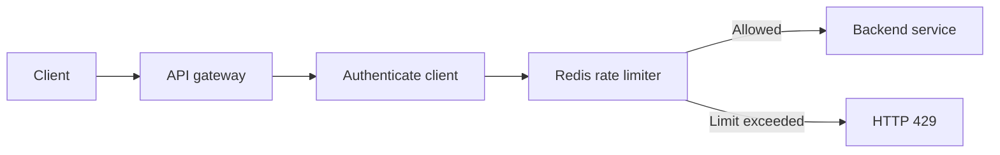

# API Gateway Rate Limiter Design

## Requirement

A client may make at most **X accepted requests during any rolling five-minute period**.

For strict enforcement across multiple API gateway instances, use a **distributed sliding-window log** backed by Redis.

## Why a fixed window is insufficient

A fixed counter might enforce:

```text
12:00–12:05: maximum X
12:05–12:10: maximum X
```

However, a client could send:

```text
X requests at 12:04:59
X requests at 12:05:01
```

That permits `2X` requests in two seconds. A rolling window instead evaluates the actual preceding five minutes:

```text
Current time: 12:05:01
Window:       12:00:01 through 12:05:01
```

## Architecture



All gateway instances share a Redis cluster:

```text
Gateway 1 ─┐
Gateway 2 ─┼──→ Redis cluster
Gateway 3 ─┘
```

This prevents a client from evading the limit by having requests routed to different gateway instances.

## Client identity and policy scope

Identify the client using a trusted authenticated value:

- API key
- OAuth client ID
- Tenant or account ID
- Authenticated user ID

Use IP addresses only when no authenticated identity exists. Do not trust an arbitrary `X-Forwarded-For` value unless a trusted proxy supplied it.

Include the client and policy scope in the rate-limit key:

```text
rate-limit:{tenantId}:{clientId}:{routeGroup}
```

For example:

```text
rate-limit:tenant-42:client-987:payments-api
```

This allows different APIs, operations, or subscription plans to have different limits.

## Sliding-window algorithm

For each client and policy, store accepted-request timestamps in a Redis sorted set:

```text
Key:   rate-limit:client-987
Score: request timestamp in milliseconds
Value: unique request ID
```

For a request arriving at `now`:

1. Calculate `cutoff = now - 5 minutes`.
2. Remove timestamps at or before the cutoff.
3. Count the remaining timestamps.
4. If the count is less than `X`, insert the current request and allow it.
5. Otherwise, reject it with HTTP `429` and calculate when the oldest request leaves the window.

```text
function allowRequest(clientId, requestId):
    window = 5 minutes
    limit = X
    now = currentTime()
    cutoff = now - window

    atomically:
        remove requests where timestamp <= cutoff
        count = number of remaining requests

        if count < limit:
            add (now, requestId)
            set expiration on client key
            return ALLOW, limit - count - 1
        else:
            oldest = earliest remaining timestamp
            retryAfter = oldest + window - now
            return REJECT, retryAfter
```

Cleanup, counting, and insertion must be atomic. Otherwise, two concurrent requests could both observe `X - 1` and both be allowed.

## Atomic Redis implementation

Use one Redis Lua script or Redis Function:

```lua
local key = KEYS[1]

local limit = tonumber(ARGV[1])
local window_ms = tonumber(ARGV[2])
local request_id = ARGV[3]

-- Use Redis server time to avoid inconsistent windows caused by
-- clock differences among gateway instances.
local redis_time = redis.call("TIME")
local now_ms =
    redis_time[1] * 1000 +
    math.floor(redis_time[2] / 1000)

local cutoff = now_ms - window_ms

-- Window semantics: (now - window, now]
redis.call(
    "ZREMRANGEBYSCORE",
    key,
    "-inf",
    cutoff
)

local count = redis.call("ZCARD", key)

if count < limit then
    redis.call(
        "ZADD",
        key,
        now_ms,
        request_id
    )

    redis.call(
        "PEXPIRE",
        key,
        window_ms + 1000
    )

    local remaining = limit - count - 1

    return {
        1,          -- allowed
        remaining,
        0,          -- retry after
        now_ms
    }
else
    local oldest = redis.call(
        "ZRANGE",
        key,
        0,
        0,
        "WITHSCORES"
    )

    local retry_after_ms =
        tonumber(oldest[2]) + window_ms - now_ms

    return {
        0,          -- rejected
        0,          -- remaining
        retry_after_ms,
        now_ms
    }
end
```

Invocation parameters:

```text
KEYS[1] = rate-limit:{clientId}
ARGV[1] = X
ARGV[2] = 300000
ARGV[3] = unique request ID
```

Use a unique sorted-set member such as:

```text
gatewayInstanceId:requestUUID
```

Do not use only a timestamp as the member. Two requests arriving in the same millisecond could overwrite one another.

## Worked example

Assume:

```text
Limit:  3 requests
Window: 5 minutes
```

Redis contains:

```text
12:01:00 → request A
12:03:00 → request B
12:04:30 → request C
```

A request arrives at `12:05:00`. The active window is `12:00:00–12:05:00`. All three requests remain in the window, so the gateway rejects the new request.

The oldest request becomes ineligible at:

```text
12:01:00 + 5 minutes = 12:06:00
```

The response can be:

```http
HTTP/1.1 429 Too Many Requests
Retry-After: 60
RateLimit-Limit: 3
RateLimit-Remaining: 0
```

At `12:06:01`, request A is outside the window and another request can be accepted.

## Gateway request path

Perform rate limiting after authentication and before forwarding:

```text
1. Receive request
2. Authenticate
3. Derive trusted client ID
4. Load the client's rate-limit policy
5. Execute the atomic Redis operation
6. If allowed, forward to the backend
7. If rejected, return HTTP 429
```

Authentication happens first because a client-supplied, unverified identifier would be easy to change and evade.

## Complexity

For a client allowed at most `X` requests:

- Storage: `O(X)` timestamps
- Insertion: `O(log X)`
- Old-record removal: `O(log X + M)`, where `M` is the number removed
- Count: `O(1)`

The Redis key expires after the window, so inactive clients do not consume long-term storage.

This works well when `X` is moderate. Storing every timestamp becomes expensive when `X` reaches hundreds of thousands or millions.

## Higher-scale approximate alternative

For very large limits, divide the five-minute period into smaller subwindows:

```text
Five-minute window divided into 10-second buckets
30 bucket counters per client
```

Example:

```text
12:00:00 → 43 requests
12:00:10 → 51 requests
12:00:20 → 39 requests
...
```

Sum the active buckets to make the decision. This requires fixed storage per active client but introduces boundary approximation. Shorter buckets improve accuracy and require more operations.

| Algorithm | Accuracy | Storage | Best use |
| --- | --- | ---: | --- |
| Fixed window | Weak at boundaries | `O(1)` | Basic, non-strict limits |
| Sliding log | Exact | `O(X)` | Strict five-minute requirement |
| Bucketed sliding counter | Approximate | Fixed per client | Very high limits |
| Token bucket | Controls average rate and bursts | `O(1)` | General traffic shaping |

For the stated strict requirement, use the sliding log.

## Redis Cluster considerations

Keep the complete operation on one Redis key so the script executes atomically on one Redis shard.

Use a Redis Cluster hash tag:

```text
rate-limit:{tenantId:clientId}:payments
```

The portion inside braces controls shard placement. All operations for that client and policy route to the same Redis shard.

One abusive client creates load on one shard, but its sorted set remains bounded near `X` accepted requests after the limit is reached. Rejected attempts still cause Redis reads, so an additional gateway-local abuse limiter may be useful.

## Multi-region enforcement

If a client can reach independent Redis clusters in several regions, each region may allow up to `X`, violating a global limit.

Strict global enforcement requires one of these designs:

1. Route each client to a designated home region.
2. Use a globally consistent rate-limit datastore.
3. Allocate a conservative portion of the quota to each region.
4. Accept and document bounded overshoot.

A practical design often sends a client's rate-limit decisions to a home region while serving the application request in another region when necessary.

## Failure policy

Choose whether the gateway fails open or closed when Redis is unavailable.

| Endpoint | Suggested policy |
| --- | --- |
| Public content | Fail open with a small local fallback limiter |
| Login or password reset | Fail closed or heavily restrict locally |
| Payment operation | Usually fail closed |
| Internal low-risk API | Depends on availability goals |

A local in-memory emergency limiter protects backend services during a Redis outage but cannot enforce the exact cluster-wide limit.

## Operational considerations

Monitor:

- Redis latency and timeout rate
- Allowed and rejected requests
- Rejection rate by policy and client
- Sorted-set cardinality
- Redis memory consumption
- Hot Redis shards
- Lua-script execution latency
- Local-fallback activation
- Clock behavior if Redis server time is not used

Decide explicitly whether these requests consume quota:

- Authentication failures
- Backend failures
- Gateway retries
- Idempotent client retries
- Requests rejected by other gateway policies

Normally only requests that pass the rate limiter are inserted into its sorted set. Rejected attempts can be counted separately for abuse detection.

## Recommended design

Use:

- A trusted authenticated client ID
- Redis Cluster
- A sorted set per client and policy
- An atomic Lua script or Redis Function
- Redis server time
- Five-minute TTL cleanup
- HTTP `429` with retry timing
- A local emergency limiter for Redis failures
- Explicit global-versus-regional semantics

This design provides exact enforcement of **at most X accepted requests during any rolling five-minute interval**.
