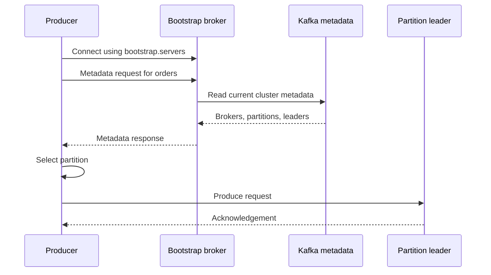

# Kafka Producer Broker and Partition Discovery

Kafka uses a **bootstrap and metadata-discovery process**. A producer starts with a few known broker addresses, asks one broker for cluster metadata, caches the result, and then sends records directly to the correct partition leaders.

## End-to-end flow



## 1. The producer starts with bootstrap servers

The producer configuration contains several known broker addresses:

```properties
bootstrap.servers=kafka-1:9092,kafka-2:9092,kafka-3:9092
```

This is an initial contact list. It does not need to contain every broker in the cluster.

The producer tries these addresses until it establishes a connection. More than one address should be listed so producer startup does not depend on one broker being available.

The selected broker is called the bootstrap broker only in the context of the initial connection. It has no permanent special bootstrap role.

## 2. The producer sends a metadata request

After connecting, the producer asks for metadata about the topic it wants to use:

```text
MetadataRequest:
    topic = orders
```

Every Kafka broker can answer a metadata request. The request does not need to reach the controller or a broker that contains a replica of the requested topic.

A simplified response might be:

```text
Brokers:
    1 → kafka-1:9092
    2 → kafka-2:9092
    3 → kafka-3:9092

Topic: orders
    Partition 0:
        leader   = broker 2
        replicas = [2, 3, 1]
        ISR      = [2, 3, 1]

    Partition 1:
        leader   = broker 1
        replicas = [1, 2, 3]
        ISR      = [1, 2, 3]

    Partition 2:
        leader   = broker 3
        replicas = [3, 1, 2]
        ISR      = [3, 1, 2]
```

The response tells the producer:

- Which brokers are in the cluster
- Each broker's address
- How many partitions the topic has
- Which broker leads each partition
- Which brokers hold replicas
- Which replicas are currently in sync

The producer now knows the broker set even if `bootstrap.servers` contained only one or two brokers.

## 3. The topic was already partitioned

The producer does not decide how many partitions the topic contains.

When the topic is created, an administrator or automated system specifies its partition and replication counts:

```bash
kafka-topics.sh \
  --bootstrap-server kafka-1:9092 \
  --create \
  --topic orders \
  --partitions 3 \
  --replication-factor 3
```

Kafka's controller records:

- The number of partitions
- The replica assignment for each partition
- The current leader for each partition

In a KRaft cluster, the controller quorum maintains this information in the replicated cluster metadata log. Brokers receive metadata updates and can answer client metadata requests.

The producer communicates with brokers for data operations. It does not normally discover or communicate directly with KRaft controllers.

## 4. The producer selects a partition

After learning that `orders` has three partitions, the producer selects one.

### Explicit partition

The application can specify a partition:

```java
new ProducerRecord<>("orders", 2, key, value);
```

This record goes to partition 2.

### Key-based partitioning

More commonly, the producer supplies a key:

```java
new ProducerRecord<>("orders", "order-123", orderEvent);
```

Conceptually:

```text
partition = hash(serializedKey) % partitionCount
```

For example:

```text
hash("order-123") % 3 = 1
```

The record goes to `orders-1`. Records with the same serialized key normally select the same partition as long as the partition count and partitioning algorithm remain unchanged.

### No key

Without a key, the standard producer distributes records while favoring batching efficiency. Applications should not depend on all unkeyed records going to a particular partition.

## 5. The producer sends directly to the leader

Suppose the producer selected partition 1 and its metadata says:

```text
orders-1 leader = broker 1
```

The producer opens or reuses a connection to `kafka-1:9092` and sends the produce request directly there:

```text
Producer → Broker 1 → orders partition 1
```

There is no central routing broker in the data path. Producers route records directly to partition leaders.

The leader appends the records and coordinates replication to the partition's followers. It acknowledges the request according to the producer's `acks` configuration.

The producer maintains separate batches for topic partitions and can combine batches headed to the same broker into efficient network requests.

## 6. Metadata is cached and refreshed

The producer caches metadata instead of requesting it for every record.

It refreshes metadata when:

- It first encounters a topic
- A topic's partition count changes
- A partition leader changes
- A broker becomes unavailable
- A response indicates that the cached leader is incorrect
- The periodic metadata refresh interval expires

The default `metadata.max.age.ms` is five minutes, so the producer periodically refreshes metadata even when it has not observed a failure.

## 7. What happens when a leader changes?

Suppose Broker 1 fails and Kafka elects Broker 2 as the new leader of `orders-1`.

The producer may temporarily have stale metadata:

```text
Cached: orders-1 → Broker 1
Actual: orders-1 → Broker 2
```

A connection failure or retriable broker error tells the producer that its metadata is stale. The producer then:

1. Requests fresh metadata from an available broker.
2. Learns that Broker 2 is the new leader.
3. Sends or retries the record against Broker 2.
4. Updates its metadata cache.

The Kafka producer client handles this rediscovery.

If all previously discovered brokers disappear, current clients can return to the original `bootstrap.servers` list and bootstrap again.

## Internal cluster discovery

Inside the cluster, the process is approximately:

```text
Broker starts
    ↓
Broker registers and maintains a session with the KRaft controller
    ↓
Controller tracks live brokers
    ↓
Controller stores topic, partition, replica, and leader metadata
    ↓
Brokers receive metadata updates
    ↓
Any broker can answer producer metadata requests
```

The controller detects broker failures through lost sessions or heartbeats and manages partition leader changes. The producer sees the resulting metadata rather than participating in controller operations.

## Practical issue: advertised addresses

Metadata contains the addresses brokers advertise to clients, normally configured with `advertised.listeners`:

```properties
advertised.listeners=SASL_SSL://kafka-1.example.com:9093
```

A common failure sequence is:

1. The producer successfully connects to the bootstrap address.
2. It receives metadata containing internal or unreachable broker hostnames.
3. It cannot connect to the partition leaders.

Every broker address returned through metadata must be reachable from the producer's network.

## Concrete example

```text
bootstrap.servers = [broker-1, broker-2]

1. Producer connects to broker-2.
2. Producer requests metadata for orders.
3. Broker-2 responds:

   orders-0 → leader broker-3
   orders-1 → leader broker-1
   orders-2 → leader broker-2

4. Producer hashes key order-123 to partition 0.
5. Producer connects directly to broker-3.
6. Producer sends the record to orders-0.
7. Broker-3 replicates it and acknowledges the producer.
```

## Mental model

> `bootstrap.servers` helps the producer enter the cluster. A metadata request supplies the broker and partition map. The record key selects a partition, and the cached metadata identifies the broker currently leading that partition.

## References

- [Apache Kafka producer configuration](https://kafka.apache.org/43/configuration/producer-configs/)
- [Apache Kafka protocol](https://kafka.apache.org/43/design/protocol/)
- [Apache Kafka design documentation](https://kafka.apache.org/43/design/design/)
- [Apache Kafka KRaft documentation](https://kafka.apache.org/43/operations/kraft/)
