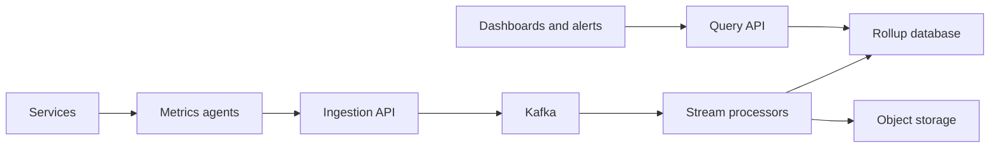
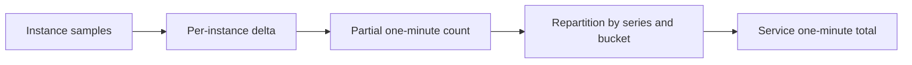
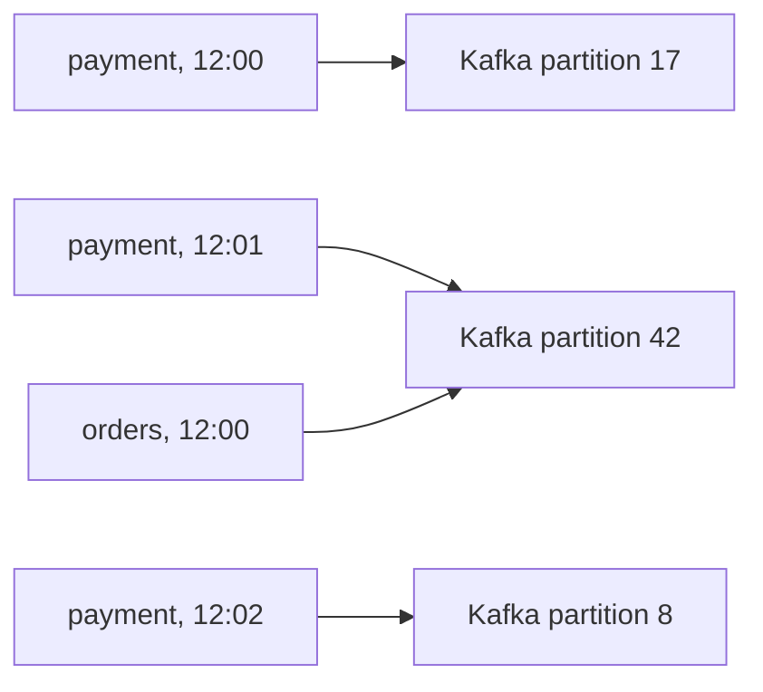

# System Design: Service Metrics Monitoring and Time-Window Aggregation

## Problem statement

Services constantly emit metrics such as request counts and transaction counts. We want to monitor service-level performance by calculating totals for:

- Every minute
- Every five minutes
- Every hour
- Every day
- Every week

The design should support many services and instances, tolerate duplicate and late metrics, survive component failures, and serve dashboard queries efficiently.

## Requirements and assumptions

### Functional requirements

For each service, calculate total requests or transactions over fixed windows and support filtering by controlled dimensions such as:

- Environment
- Region
- Availability zone
- Status class
- Endpoint or operation, when cardinality is manageable

### Operational assumptions

- Thousands of service instances may report concurrently.
- Results should normally appear within 10–30 seconds.
- Recent buckets may be preliminary while late metrics arrive.
- Counts become final after an allowed lateness period.
- Time windows are non-overlapping tumbling windows, such as `12:00–12:05` and `12:05–12:10`.
- Internal timestamps and window boundaries use UTC.

"Requests during the last five minutes" is a sliding-window query and requires different windowing behavior from fixed five-minute buckets.

## High-level architecture



### Components

1. **Service metrics library** maintains local counters without sending one message per application request.
2. **Metrics agent** samples counters every 10–15 seconds, batches and compresses samples, and retries failed deliveries.
3. **Ingestion API** authenticates services, validates metrics and dimensions, and writes accepted samples to Kafka.
4. **Kafka** buffers traffic spikes, decouples producers from processors, and retains data for replay.
5. **Stream processors** deduplicate samples, calculate deltas, aggregate one-minute buckets, and build larger rollups.
6. **Rollup database** stores bucketed metrics and supports fast range queries.
7. **Object storage** preserves raw samples for auditing and backfills.

## Counter collection

### Avoid one event per request

A service processing 100,000 requests per second should not send 100,000 monitoring messages per second. It should maintain an in-memory monotonic counter:

```text
requests_total = 9,100
requests_total = 9,850
requests_total = 10,700
```

The agent periodically reports the counter:

```json
{
  "service": "payment-api",
  "instanceId": "payment-api-7f985c",
  "metric": "requests_total",
  "counterValue": 10700,
  "processEpoch": "2026-09-25T15:00:00Z",
  "sequence": 481,
  "timestamp": "2026-09-25T16:42:10Z",
  "tags": {
    "environment": "production",
    "region": "us-east-1",
    "statusClass": "2xx"
  }
}
```

The processor calculates the delta:

```text
previous value = 9,850
current value  = 10,700
delta          = 850 requests
```

Cumulative counters provide several advantages:

- Retries do not inherently add requests twice.
- A missed sample can be recovered from the next counter value.
- Samples can be deduplicated using instance, process epoch, and sequence.
- Counter resets can be recognized when a process restarts.

The `processEpoch` distinguishes a legitimate restart from an unexpected counter decrease.

## Metric identity and cardinality

A metric series is identified by its metric name and normalized dimensions:

```text
seriesId = hash(
    tenant,
    service,
    metric,
    environment,
    region,
    statusClass
)
```

The final service-level series identity should not include `instanceId`. The instance ID is needed to calculate per-instance deltas, after which values from all instances are combined.

Avoid unbounded dimensions such as:

- Request ID
- Customer ID
- Session ID
- Raw URLs containing identifiers
- Error message text

These values can create millions of series and overwhelm aggregation and storage.

## Kafka partitioning and staged aggregation

### First-stage partitioning

Partition raw counter samples using:

```text
hash(seriesId, instanceId)
```

This keeps samples from one service instance ordered so the processor can calculate counter deltas correctly.

### Stage 1: partial aggregation

The first stage:

1. Calculates the delta between consecutive cumulative samples.
2. Assigns that delta to a one-minute event-time bucket.
3. Produces a partial aggregate.

### Stage 2: service aggregation

Partial results are repartitioned using:

```text
(seriesId, bucketStart)
```

All partial results for the same series and minute therefore reach the same logical final aggregator.



## One-minute aggregation

Each sample delta is placed into a one-minute event-time bucket:

```text
bucketStart = floor(eventTimestamp / 60 seconds) * 60 seconds
```

For example:

```text
16:42:00–16:42:59 → bucket 16:42:00
```

Suppose three instances report:

| Instance | Delta |
| --- | ---: |
| `payment-1` | 8,200 |
| `payment-2` | 7,950 |
| `payment-3` | 8,600 |
| **Service total** | **24,750** |

The resulting rollup is:

```json
{
  "seriesId": "payment-api.requests.production.us-east-1",
  "resolution": "1m",
  "bucketStart": "2026-09-25T16:42:00Z",
  "count": 24750,
  "version": 4,
  "final": false
}
```

## Late and out-of-order data

Metrics may arrive late because of network interruption, agent retries, Kafka backlog, service overload, or clock differences.

The processor uses event time, rather than processing time, to select a bucket. A watermark controls normal lateness:

```text
allowed lateness = 2 minutes
```

At `16:45`, the `16:42` bucket can be considered final. A sample arriving later can still create a correction when the system supports a longer correction period.

Dashboards can identify buckets as:

- **Preliminary:** still accepting normally late data.
- **Final:** the watermark has passed.
- **Corrected:** late data changed an already finalized bucket.

## Deduplication and idempotency

An agent retries when it does not receive an acknowledgement, which can produce duplicates.

Define the sample identity as:

```text
sampleId = (instanceId, processEpoch, sequence)
```

The processor maintains bounded deduplication state:

```text
if sampleId has already been processed:
    ignore it
else:
    process it
    remember sampleId
```

Retain this state longer than the maximum retry period.

Use versioned database upserts instead of blind increments:

```text
primary key = seriesId + resolution + bucketStart
write only when incoming version > stored version
```

This prevents a replayed processor output from increasing a stored total twice.

## Building larger rollups

Use one-minute buckets as the canonical aggregation layer.

### Five-minute total

```text
12:00 bucket =
    minute 12:00 +
    minute 12:01 +
    minute 12:02 +
    minute 12:03 +
    minute 12:04
```

### Other rollups

```text
hour = sum of 60 one-minute buckets
day  = sum of 24 hourly buckets
week = sum of 7 daily buckets
```

Larger windows could be computed during queries, but materializing the fixed rollups gives predictable latency and reduces database work.

### Propagating corrections

Suppose a late sample changes a one-minute bucket from 1,000 to 1,025:

```text
old value        = 1,000
new value        = 1,025
correction delta = +25
```

Propagate `+25` to the affected five-minute, hourly, daily, and weekly buckets. Do not add the complete new value again.

A safer alternative is to recompute the affected parent from its child buckets:

```text
five-minute total = sum(its five one-minute buckets)
```

Recomputation is often simpler and more resistant to duplicate correction messages.

## Storage model

A logical rollup table could look like this:

```sql
CREATE TABLE metric_rollups (
    tenant_id       VARCHAR,
    series_id       VARCHAR,
    resolution      VARCHAR,
    bucket_start    TIMESTAMP,
    count_value     BIGINT,
    version         BIGINT,
    finalized       BOOLEAN,
    updated_at      TIMESTAMP,
    PRIMARY KEY (
        tenant_id,
        series_id,
        resolution,
        bucket_start
    )
);
```

Example rows:

| Series | Resolution | Bucket | Count |
| --- | --- | --- | ---: |
| `payment.requests` | `1m` | `16:42` | 24,750 |
| `payment.requests` | `5m` | `16:40` | 121,390 |
| `payment.requests` | `1h` | `16:00` | 1,430,280 |
| `payment.requests` | `1d` | `2026-09-25` | 31,902,115 |

Potential storage systems include:

- ClickHouse
- Apache Druid
- Apache Pinot
- Cassandra or ScyllaDB with carefully designed keys
- A distributed time-series database
- Amazon Timestream for an AWS-managed implementation

Physically distribute data by time and series hash:

```text
physical partition = date + hash(seriesId) % N
```

## Retention policy

Retain coarser rollups longer:

| Data | Example retention |
| --- | ---: |
| Raw counter samples in Kafka | 3–7 days |
| Raw archive in object storage | 30–90 days |
| One-minute rollups | 30 days |
| Five-minute rollups | 90 days |
| Hourly rollups | 2 years |
| Daily rollups | 5 years |
| Weekly rollups | Indefinite or policy-based |

## Query API

Example request:

```http
GET /v1/metrics/requests_total
    ?service=payment-api
    &from=2026-09-25T12:00:00Z
    &to=2026-09-25T16:00:00Z
    &resolution=5m
    &region=us-east-1
```

Example response:

```json
{
  "service": "payment-api",
  "metric": "requests_total",
  "resolution": "5m",
  "points": [
    {
      "start": "2026-09-25T12:00:00Z",
      "count": 121390,
      "final": true
    },
    {
      "start": "2026-09-25T12:05:00Z",
      "count": 124180,
      "final": true
    }
  ]
}
```

The query service should:

- Select the correct rollup resolution.
- Fill missing buckets with zero only when zero is known to be correct.
- Return bucket finality.
- Limit time ranges and series counts.
- Cache common dashboard queries.

A missing sample is different from a confirmed value of zero and should be represented explicitly.

## Daily and weekly boundaries

Store timestamps internally in UTC. Define weekly buckets precisely, for example:

```text
ISO week = Monday 00:00 UTC through the next Monday 00:00 UTC
```

For reports aligned to a customer's timezone, store the timezone with the reporting configuration. A local calendar day may contain 23 or 25 hours because of daylight-saving transitions.

## Failure handling

### Ingestion API failure

- Clients retry with the same sample ID.
- Stateless ingestion nodes run behind a load balancer.
- Acknowledge a sample only after Kafka accepts it.

### Kafka failure

Use:

- Replication factor 3
- `acks=all`
- `min.insync.replicas=2`
- Brokers spread across availability zones

### Processor failure

- Checkpoint processing state.
- Restore from Kafka and the latest checkpoint.
- Use deterministic, idempotent rollup writes.

### Database failure

- Replicate storage across availability zones.
- Buffer output in Kafka while storage recovers.
- Replay rollup updates after recovery.

### Invalid input

Send rejected samples to a dead-letter topic with a reason.

## Monitoring the monitoring system

Track:

- Ingestion requests per second
- Rejected samples
- Kafka producer failures
- Kafka consumer lag
- Sample-to-query latency
- Preliminary and corrected bucket counts
- Storage compaction backlog
- Cardinality by tenant, service, and metric
- Missing instance reports
- Counter reset frequency
- Rollup reconciliation failures

## Example AWS deployment

```text
Service SDK or agent
        ↓
Load balancer and ingestion service
        ↓
Amazon MSK or Kinesis Data Streams
        ↓
Apache Flink stream processing
        ↓
ClickHouse or Amazon Timestream
        ↓
Query service
        ↓
Grafana, dashboards, and alerts
```

The one-minute bucket should be the canonical rollup. Preserve raw samples temporarily for recovery and corrections, and precompute the fixed larger resolutions.

---

# Detailed Explanation: Repartitioning by `bucketStart`

The stream processors do **not** need to be reconfigured every minute. The key distinction is between Kafka partitions and time buckets:

- Kafka partitions are a fixed set of physical shards, such as 64 or 256 partitions.
- Time buckets are logical aggregation keys created continuously as records arrive.

`bucketStart` becomes part of each record's key. Kafka hashes the key onto one of the existing physical partitions.

## Dynamic keys over fixed Kafka partitions

Suppose the final aggregation key is:

```text
(seriesId, bucketStart)
```

For `payment-api`, records might use:

```text
(payment.requests, 12:00)
(payment.requests, 12:01)
(payment.requests, 12:02)
```

Kafka applies its normal partitioning function:

```text
kafkaPartition =
    hash(seriesId, bucketStart) % numberOfKafkaPartitions
```

With 64 Kafka partitions, the mapping might be:

```text
(payment.requests, 12:00) → Kafka partition 17
(payment.requests, 12:01) → Kafka partition 42
(payment.requests, 12:02) → Kafka partition 8
```

The Kafka topic still has 64 partitions. Only the record key changes.



The processor consumer group already consumes the fixed Kafka partitions. New minutes create new keys inside those partitions; they do not create new Kafka partitions or trigger reconfiguration.

## Why the key must include `seriesId`

Do not repartition using only:

```text
key = bucketStart
```

That would send every series for the same minute to one hot Kafka partition:

```text
payment.requests, 12:00 ─┐
orders.requests, 12:00 ──┼──→ one hot Kafka partition
search.requests, 12:00 ──┘
```

Use:

```text
key = (seriesId, bucketStart)
```

Different metric series then distribute across Kafka partitions, while all partial results for one metric bucket reach the same final aggregator.

## Concrete repartitioning example

Suppose `payment-api` has three instances. Stage 1 produces:

```text
payment-1: series=payment.requests, bucket=12:00, count=8,200
payment-2: series=payment.requests, bucket=12:00, count=7,950
payment-3: series=payment.requests, bucket=12:00, count=8,600
```

Before writing to the repartition topic, Stage 1 assigns the same key to all three records:

```text
key = (payment.requests, 12:00)
```

They consequently hash to the same Kafka partition. The Stage 2 processor owning that partition calculates:

```text
8,200 + 7,950 + 8,600 = 24,750
```

At `12:01`, the key becomes:

```text
(payment.requests, 12:01)
```

It may hash to a different Kafka partition and be handled by a different processor. That is safe because the `12:00` and `12:01` buckets are independent.

## Processor state

Each Stage 2 processor holds state by logical aggregation key:

```text
(payment.requests, 12:00) → 24,750
(payment.requests, 12:01) → 18,420
(order.requests,   12:00) → 12,190
```

An incoming update is applied as follows:

```text
key = (record.seriesId, record.bucketStart)
state[key] = state.get(key, 0) + record.count
```

Once the event-time watermark passes the allowed lateness period, the processor emits the result:

```text
when watermark > bucketStart + 1 minute + allowedLateness:
    emit state[key]
```

For example:

```text
Bucket:           12:00–12:01
Allowed lateness: 2 minutes
Finalize after:   12:03
```

After the correction window, the processor expires the state:

```text
state retention =
    window duration +
    allowed lateness +
    correction margin
```

## Kafka Streams example

Conceptually:

```java
KStream<InstanceKey, MetricDelta> deltas = ...;

KTable<MetricBucketKey, Long> minuteTotals =
    deltas
        .selectKey((instanceKey, delta) ->
            new MetricBucketKey(
                delta.seriesId(),
                truncateToMinute(delta.eventTime())
            )
        )
        .groupByKey()
        .aggregate(
            () -> 0L,
            (key, delta, total) -> total + delta.count()
        );
```

`selectKey` assigns the new logical key. Because the key changed, `groupByKey` causes Kafka Streams to create or use a repartition topic.

The repartition topic has a fixed number of partitions:

```text
metrics-minute-repartition:
    partition 0
    partition 1
    ...
    partition 63
```

Kafka Streams instances consume these partitions normally. The processing topology does not change each minute.

## Flink example

The equivalent Flink operation is conceptually:

```java
stream
    .keyBy(event ->
        new MetricBucketKey(
            event.seriesId(),
            truncateToMinute(event.eventTime())
        )
    )
    .window(TumblingEventTimeWindows.of(Duration.ofMinutes(1)))
    .sum("count");
```

`keyBy` hashes each dynamic key across the fixed downstream parallel tasks. The window operator manages bucket creation, event-time timers, late records, and state expiration.

## Handling a very hot metric bucket

For most services, routing one `(seriesId, bucketStart)` to one processor works well. A very large service may make that logical key too hot.

Use a two-level key:

```text
Stage 1 key = (seriesId, bucketStart, shardId)
shardId     = hash(instanceId) % 16
```

This produces partial buckets such as:

```text
(payment.requests, 12:00, shard 2)
(payment.requests, 12:00, shard 7)
(payment.requests, 12:00, shard 11)
```

Stage 1 calculates up to 16 shard totals. Stage 2 then removes `shardId` from the key:

```text
(payment.requests, 12:00)
```

and combines at most 16 partial records rather than all original source samples.

## What actually causes processor reassignment?

A new minute does not reassign processors. Reassignment happens only when an operational change occurs, such as:

- A processor instance starts, stops, or fails.
- The consumer group rebalances.
- Processing parallelism changes.
- The repartition topic's Kafka partition count changes.

Normal creation of new `(seriesId, bucketStart)` keys occurs within the existing topology.

## Mental model

> `bucketStart` identifies a short-lived state entry. Kafka's fixed partitions determine which processor owns that state entry. A new minute creates new state, not new infrastructure.
